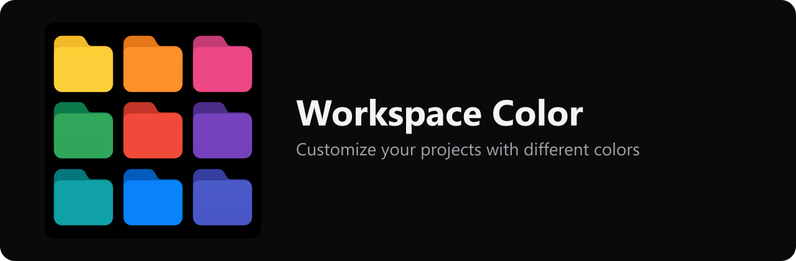
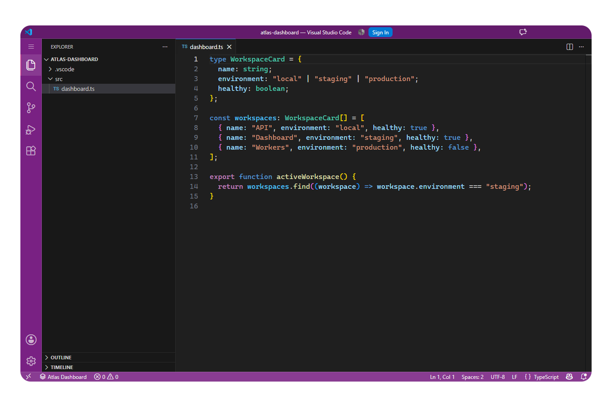

# Color My Workspaces

>  **Give each VS Code or Cursor folder its own color on the title bar, activity bar, status bar, and command center.**
## Getting started

1) Install **Color My Workspaces** from the [VS Code Marketplace](https://marketplace.visualstudio.com/items?itemName=gvastethecreator.color-my-workspaces)
2) Open a folder, and click the project name on the left of the status bar to change the color.

  
  
  
  

