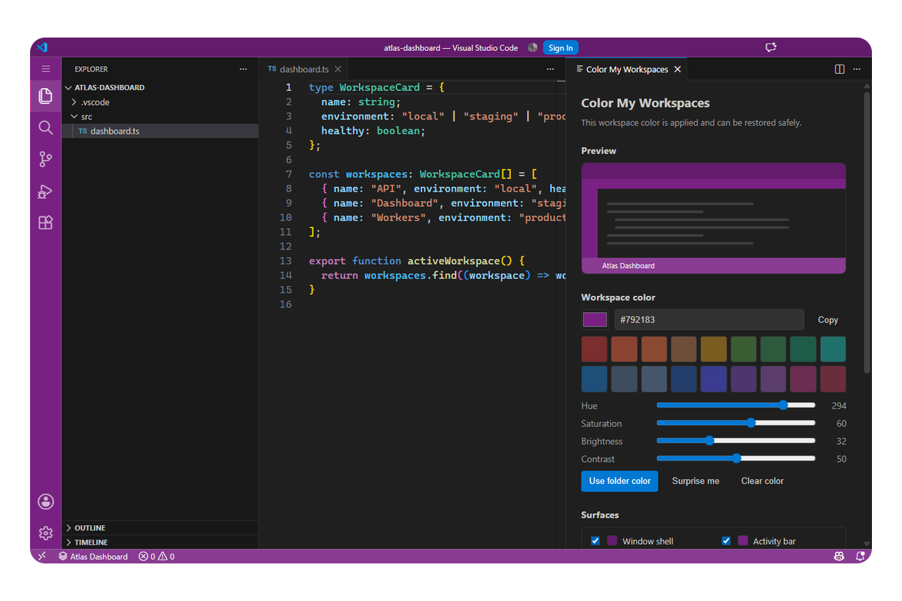

  

# Color My Workspaces

**Give every VS Code workspace a clear, reversible visual identity.**

  
  
  

Color the title bar, activity bar, Status Bar, and command center with a stable workspace color.

<table>
  <tr>
    <td width="50%"></td>
    <td width="50%"></td>
  </tr>
  <tr>
    <td align="center">Colored workspace</td>
    <td align="center">Minimal settings</td>
  </tr>
</table>

## Highlights

- Stable colors for local, remote, virtual, saved, and multi-root workspaces.
- Explicit first apply, optional automatic reapply, and safe restore with **Clear Color**.
- Per-surface controls, accessible contrast, and High Contrast support.
- Compact Quick Pick and full settings panel.

## Use

Open a folder or saved workspace, then run **Color My Workspaces: Apply Color from Folder** or click the workspace item in the Status Bar. Applying a color can update workspace settings; review that change before committing it.

Requires VS Code 1.134 or newer on desktop. No telemetry, product network requests, document scanning, or workspace-code execution.

More details: [product contract](docs/PDR.md) · [compatibility](docs/compatibility.md) · [development](docs/development.md)
